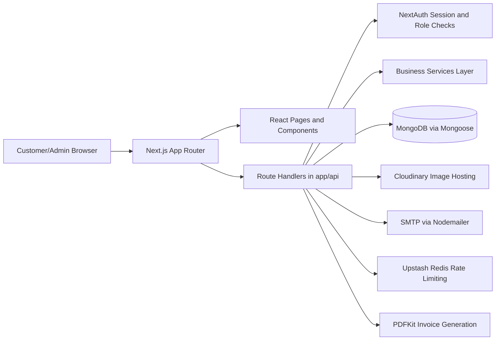
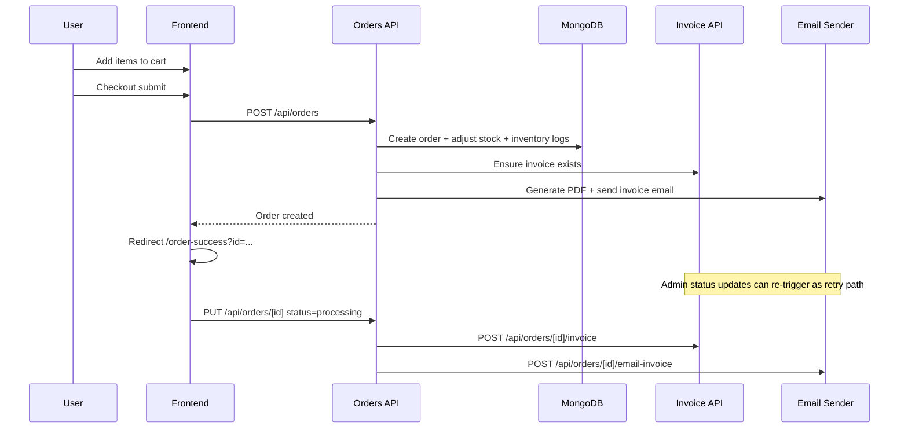

# Furniture Store Repository Documentation

## 1. Project At A Glance

- Project name: `furniture_store`
- Primary domain: Full-stack e-commerce for premium furniture with customer storefront and admin back office
- Stack type: Monolithic Next.js App Router application (frontend + backend API in one repo)
- Runtime: Node.js
- Database: MongoDB (Mongoose ODM)
- Authentication: NextAuth (Credentials + Google OAuth)
- Core business domains:
  - Product catalog and storefront browsing
  - Cart and checkout flow
  - Order management and customer order history
  - Invoice generation (PDF) and invoice email delivery
  - Inventory updates and inventory logs
  - Employee attendance and weekly reports
  - Customer contact and custom furniture inquiries
  - Global business settings (brand/contact/address)

## 2. Non-Technical Explanation

This project is a complete furniture business platform with two sides:

- Customer side:
  - Customers browse products, search and filter furniture, add items to cart, checkout, and track their orders.
  - Customers can contact the company and submit custom furniture requirements.
- Admin side:
  - Admins manage products, stock, orders, customers, inquiries, employees, attendance, analytics, and business profile settings.
  - Admins can generate/download invoices and email invoices to customers.

In short, this codebase runs both the public website and the internal operations panel for the business.

## 3. System Architecture

### 3.1 High-Level Architecture

### 3.2 Architectural Layers

- Presentation layer:
  - App Router pages in `app/`
  - Shared components in `components/`
- Application/API layer:
  - Route handlers in `app/api/**/route.js`
- Domain/service layer:
  - `services/orderService.js`
  - `services/invoiceService.js`
  - `services/inventoryService.js`
  - Validation helpers in `lib/validation/`
- Data layer:
  - Mongoose models in `lib/models/`
  - Mongo connection in `lib/mongodb.js`
- Integration layer:
  - Cloudinary (`lib/cloudinary.js`)
  - SMTP email (`lib/emailSender.js`)
  - PDF generation (`lib/pdfGenerator.js`)
  - Redis-based rate limiting (`lib/api/rateLimit.js`)

### 3.3 Request Lifecycle (Typical)

1. Browser calls an API route under `app/api/...`.
2. Route performs auth/role check (`requireUserSession` or `requireAdminSession`) when required.
3. Route validates payload (`lib/validation/*`) and IDs (`validateObjectId`).
4. Route executes DB operations via models/services.
5. Route optionally calls external integrations (Cloudinary/SMTP/PDF/Redis).
6. Route returns standardized JSON via `successResponse` or `errorResponse`.

## 4. Technology Stack

### 4.1 Core Frameworks and Libraries

- Next.js `16.1.6`
- React `19.2.3`
- NextAuth `4.24.13`
- Mongoose `9.3.0`
- Tailwind CSS `4`
- Recharts `3.8.0`
- Nodemailer `7.0.13`
- PDFKit `0.17.2`
- Cloudinary `2.9.0`
- Upstash Redis + Ratelimit
- Vitest `4.1.0`
- ESLint `9`

Source: `package.json`.

### 4.2 Build and Runtime Commands

- Dev server: `npm run dev`
- Build: `npm run build`
- Production start: `npm run start`
- Lint: `npm run lint`
- Tests: `npm test`
- Seed data: `npm run seed`

## 5. Repository Structure

## 5.1 Top-Level Tree (Condensed)

- `app/`:
  - Customer pages (`/`, `/shop`, `/product/[id]`, `/cart`, `/checkout`, `/contact`, `/custom-furniture`, `/about`, `/login`, `/register`, `/order-success`, `/profile/orders`)
  - Admin pages (`/admin/*`)
  - API routes (`app/api/**/route.js`)
- `components/`:
  - Shared UI and admin sidebar
- `context/`:
  - Cart context and localStorage-backed cart state
- `lib/`:
  - Auth, DB, validation, integrations, config, models, response helpers
- `services/`:
  - Order and inventory domain services
- `scripts/`:
  - Seed scripts
- `.github/workflows/ci.yml`:
  - CI pipeline
- `DEPLOYMENT.md`:
  - Deployment runbook
- `.env.production.example`:
  - Production env template

## 6. File-Level Documentation

### 6.1 Core Runtime and Platform Files

- `app/layout.js`:
  - Global metadata.
  - Wraps app with `SessionProvider` + `CartProvider` via `components/Providers.js`.
  - Mounts global `WhatsAppButton`.
- `components/Providers.js`:
  - Root providers composition.
- `next.config.js`:
  - Security headers.
  - CORS headers for `/api/*`.
  - `serverExternalPackages` for `pdfkit` and `nodemailer`.
  - Remote image allowlist (`images.unsplash.com`, `res.cloudinary.com`).
- `proxy.js`:
  - NextAuth middleware route protection:
    - `/admin/*` requires admin role.
    - `/cart` and `/checkout` require authenticated user.
- `.github/workflows/ci.yml`:
  - Runs lint, test, and build on push/PR.

### 6.2 Authentication and Session

- `lib/auth.js`:
  - NextAuth config.
  - Providers: Google and Credentials.
  - Credentials path validates bcrypt password against `User` model.
  - JWT/session callbacks enrich `session.user` with `id` and `role`.
- `app/api/auth/[...nextauth]/route.js`:
  - Exposes NextAuth GET/POST handlers.
- `lib/auth/session.js`:
  - `getServerAuthSession()`
  - `requireUserSession()`
  - `requireAdminSession()`

### 6.3 Database Access and Models

- `lib/mongodb.js`:
  - Cached Mongoose connection pattern.
- Models:
  - `lib/models/User.js`
  - `lib/models/Product.js`
  - `lib/models/Order.js`
  - `lib/models/Invoice.js`
  - `lib/models/InventoryLog.js`
  - `lib/models/Employee.js`
  - `lib/models/Attendance.js`
  - `lib/models/ShopDay.js`
  - `lib/models/CustomInquiry.js`
  - `lib/models/GlobalSettings.js`

### 6.4 Validation and API Utilities

- `lib/validation/common.js`: string/email/password sanitization/validation.
- `lib/validation/product.js`: product payload validation.
- `lib/validation/order.js`: order payload validation.
- `lib/validation/inventory.js`: inventory update validation.
- `lib/validation/mongodb.js`: object id validation.
- `lib/api/response.js`: standard JSON response helpers.
- `lib/response.js`: compatibility re-export for response helpers.
- `lib/api/logger.js`: structured `logInfo`/`logError`.
- `lib/api/rateLimit.js`:
  - Upstash Redis sliding window.
  - Safe fallback to in-memory limiter if Redis unavailable.

### 6.5 External Integrations

- `lib/cloudinary.js`: secure Cloudinary client init and URL optimization.
- `lib/emailSender.js`:
  - SMTP transporter initialization and verification.
  - Sends contact emails, custom inquiry emails, and invoice emails.
- `lib/pdfGenerator.js`:
  - Invoice PDF generation.

### 6.6 Domain Services

- `services/orderService.js`:
  - Generates human-readable tracking `orderId` in `DDMMYYYY + sequence` format.
  - Creates order.
  - Decrements inventory and increments product sales.
  - Creates inventory logs for order-driven stock reduction.
- `services/invoiceService.js`:
  - Shared invoice pipeline used by both automatic and manual invoice flows.
  - Ensures invoice record exists/upserts data (`ensureInvoiceForOrder`).
  - Builds invoice PDF payload and sends invoice email (`sendOrderInvoiceEmail`).
  - Runs resilient auto generate+send orchestration (`autoGenerateAndSendInvoiceForOrder`) with safe logging and non-fatal failures.
- `services/inventoryService.js`:
  - Applies inventory change types.
  - Creates inventory logs.

### 6.7 Business Configuration and Dynamic Settings

- `lib/businessConfig.js`:
  - Default brand/contact/address constants.
  - Merge helper for partial settings.
- `lib/settingsService.js`:
  - Reads/writes global business settings in DB.
- `lib/useBusinessSettings.js`:
  - Client hook to fetch `/api/settings` with fallback defaults.

## 7. Feature Documentation

### 7.1 Storefront Features

- Home and marketing: `app/page.js`
- Product discovery:
  - Shop with filters/search/sort: `app/shop/page.js`
  - Product detail pages: `app/product/[id]/page.js`
- Cart management:
  - `app/cart/page.js`
  - Backed by `context/CartContext.js`
- Checkout and order creation:
  - `app/checkout/page.js`
  - Auth-protected (via middleware)
- Order success and details:
  - `app/order-success/page.js`
- Account and order history:
  - `app/profile/orders/page.js`
- Contact and custom inquiry:
  - `app/contact/page.js`
  - `app/custom-furniture/page.js`

### 7.2 Admin Features

- Dashboard overview: `app/admin/page.js`
- Product CRUD: `app/admin/products/page.js`
- Order management + status updates: `app/admin/orders/page.js`, `app/admin/orders/[id]/page.js`
- Invoice operations from admin:
  - generate
  - download
  - email
- Inventory view and update: `app/admin/inventory/page.js`
- Employee CRUD: `app/admin/employees/page.js`
- Attendance and report: `app/admin/attendance/page.js`, `app/admin/attendance/report/page.js`
- Customer analytics/listing: `app/admin/customers/page.js`
- Custom inquiry inbox: `app/admin/custom-inquiries/page.js`
- Business settings editor: `app/admin/settings/page.js`
- Analytics dashboard: `app/admin/analytics/page.js`

### 7.3 Cross-Cutting UX Features

- Global navigation and account menu: `components/Navbar.jsx`
- Footer with dynamic business info: `components/Footer.jsx`
- Floating WhatsApp CTA: `components/WhatsAppButton.jsx`

## 8. API Documentation

## 8.1 Response Contract

Most endpoints return:

- Success: `{ success: true, data: ... }`
- Error: `{ success: false, error: "..." }`

Helpers used from `lib/api/response.js`.

## 8.2 Endpoint Catalog

### Auth and User Management

- `POST /api/register`
  - File: `app/api/register/route.js`
  - Auth: Public
  - Validates and rate limits registration; hashes password; creates user.
- `GET|POST /api/auth/[...nextauth]`
  - File: `app/api/auth/[...nextauth]/route.js`
  - Auth: NextAuth handlers

### Product Catalog

- `GET /api/products`
  - File: `app/api/products/route.js`
  - Auth: Public
  - Supports pagination, category/material/availability, min/max price, search, and sorting.
- `POST /api/products`
  - File: `app/api/products/route.js`
  - Auth: Admin
  - Creates product.
- `GET /api/products/[id]`
  - File: `app/api/products/[id]/route.js`
  - Auth: Public
- `PUT /api/products/[id]`
  - File: `app/api/products/[id]/route.js`
  - Auth: Admin
- `DELETE /api/products/[id]`
  - File: `app/api/products/[id]/route.js`
  - Auth: Admin

### Orders and Invoices

- `GET /api/orders`
  - File: `app/api/orders/route.js`
  - Auth: Admin
  - Returns all orders for admin.
- `POST /api/orders`
  - File: `app/api/orders/route.js`
  - Auth: Authenticated user
  - Creates order and adjusts inventory.
  - Automatically triggers invoice generation + invoice email send after successful order creation.
- `GET /api/orders/me`
  - File: `app/api/orders/me/route.js`
  - Auth: Authenticated user
  - Returns current user's orders.
- `GET /api/orders/[id]`
  - File: `app/api/orders/[id]/route.js`
  - Auth: Admin or order owner
  - Accepts either Mongo `_id` or tracking `orderId` in path.
- `PUT /api/orders/[id]`
  - File: `app/api/orders/[id]/route.js`
  - Auth: Admin
  - Updates order status.
  - On status progression (`processing|shipped|delivered`) triggers invoice generate + email pipeline as a retry/supplemental mechanism.
  - Accepts either Mongo `_id` or tracking `orderId` in path.
- `GET /api/orders/[id]/invoice`
  - File: `app/api/orders/[id]/invoice/route.js`
  - Auth: Admin or order owner
  - Downloads invoice PDF (or generates if needed by code path).
  - Accepts either Mongo `_id` or tracking `orderId` in path.
- `POST /api/orders/[id]/invoice`
  - File: `app/api/orders/[id]/invoice/route.js`
  - Auth: Admin
  - Generates/upserts invoice record.
  - Accepts either Mongo `_id` or tracking `orderId` in path.
- `POST /api/orders/[id]/email-invoice`
  - File: `app/api/orders/[id]/email-invoice/route.js`
  - Auth: Admin
  - Sends invoice PDF to customer email.
  - Accepts either Mongo `_id` or tracking `orderId` in path.

### Inventory

- `GET /api/inventory`
  - File: `app/api/inventory/route.js`
  - Auth: Admin
- `GET /api/inventory/logs`
  - File: `app/api/inventory/logs/route.js`
  - Auth: Admin
  - Returns latest 100 logs.
- `POST /api/inventory/update`
  - File: `app/api/inventory/update/route.js`
  - Auth: Admin
  - Applies stock increase/decrease/manual adjustment.

### Employees and Attendance

- `GET /api/employees`
  - File: `app/api/employees/route.js`
  - Auth: Admin
- `POST /api/employees`
  - File: `app/api/employees/route.js`
  - Auth: Admin
- `GET /api/employees/[id]`
  - File: `app/api/employees/[id]/route.js`
  - Auth: Admin
- `PUT /api/employees/[id]`
  - File: `app/api/employees/[id]/route.js`
  - Auth: Admin
- `DELETE /api/employees/[id]`
  - File: `app/api/employees/[id]/route.js`
  - Auth: Admin
- `GET /api/attendance`
  - File: `app/api/attendance/route.js`
  - Auth: Admin or manager
  - Daily attendance by date or weekly aggregate report (`?weekly=true`).
- `POST /api/attendance`
  - File: `app/api/attendance/route.js`
  - Auth: Admin or manager
  - Bulk upsert attendance.
- `GET /api/shopday`
  - File: `app/api/shopday/route.js`
  - Auth: Admin or manager
- `POST /api/shopday`
  - File: `app/api/shopday/route.js`
  - Auth: Admin or manager

### Admin Analytics and Settings

- `GET /api/admin/stats`
  - File: `app/api/admin/stats/route.js`
  - Auth: Admin
  - Dashboard aggregate metrics.
- `GET /api/admin/users`
  - File: `app/api/admin/users/route.js`
  - Auth: Admin
  - Lists users excluding password field.
- `GET /api/admin/settings`
  - File: `app/api/admin/settings/route.js`
  - Auth: Admin
  - Returns business settings.
- `PUT /api/admin/settings`
  - File: `app/api/admin/settings/route.js`
  - Auth: Admin
  - Validates/sanitizes and updates business settings.
- `GET /api/settings`
  - File: `app/api/settings/route.js`
  - Auth: Public
  - Read-only business settings for public UI.

### Contact and Inquiry

- `POST /api/contact`
  - File: `app/api/contact/route.js`
  - Auth: Public
  - Rate-limited; validates input; sends contact email.
- `POST /api/custom-inquiry`
  - File: `app/api/custom-inquiry/route.js`
  - Auth: Public
  - Rate-limited; validates input; stores inquiry; sends notification email.
- `GET /api/custom-inquiry`
  - File: `app/api/custom-inquiry/route.js`
  - Auth: Admin
  - Lists inquiries.

### File Uploads

- `POST /api/upload`
  - File: `app/api/upload/route.js`
  - Auth: Admin
  - Accepts image files from multipart form data key `images`.
  - Validates type and size.
  - Uploads to Cloudinary and returns optimized URLs.

## 9. Database Model Documentation

### 9.1 User (`lib/models/User.js`)

- Purpose: Customer/admin identity and role.
- Key fields:
  - `name` (required)
  - `email` (required, unique)
  - `password` (optional for OAuth users)
  - `role` (`user|admin`, default `user`)
  - `phone`

### 9.2 Product (`lib/models/Product.js`)

- Purpose: Catalog items and stock state.
- Key fields:
  - `name`, `price`, `description`, `category`, `material`, `dimensions`
  - `images[]`
  - `stock`, `lowStockThreshold`, `status`
  - `isFeatured`, `sales`
  - `warranty` object
- Hooks/indexes:
  - Pre-save stock-to-status sync.
  - Weighted text index across name/description/category/material.

### 9.3 Order (`lib/models/Order.js`)

- Purpose: Customer purchase transaction.
- Key fields:
  - `orderId` (required, unique, site-wide tracking id)
  - `userId` (nullable for legacy/anonymous)
  - `customerInfo` block
  - `products[]` snapshot
  - `subtotal`, `shipping`, `total`
  - `paymentMethod`
  - `status` (`pending|processing|shipped|delivered|cancelled`)

### 9.11 OrderSequence (`lib/models/OrderSequence.js`)

- Purpose: Daily sequence counter backing tracking-order-id generation.
- Key fields:
  - `dateKey` (unique, format `DDMMYYYY` in `Asia/Kolkata` timezone)
  - `sequence` (monotonic increment per `dateKey`)

### 9.4 Invoice (`lib/models/Invoice.js`)

- Purpose: Financial document attached to one order.
- Key fields:
  - `invoiceId` (unique)
  - `orderId` (unique ref)
  - `customerId`
  - `items[]` with warranty details
  - `pricing` object
  - `paymentStatus`
  - `generatedBy`

### 9.5 InventoryLog (`lib/models/InventoryLog.js`)

- Purpose: Audit trail for stock changes.
- Key fields:
  - `productId`, `productName`
  - `changeType` (`increase|decrease|manual_adjustment`)
  - `quantityChanged`, `previousStock`, `newStock`
  - `reason` (`order|restock|admin_edit`)

### 9.6 Employee (`lib/models/Employee.js`)

- Purpose: Internal workforce records.
- Key fields:
  - `name`
  - `employeeId` (unique)
  - `age`, `phone`, `department`
  - `role` (`admin|manager|staff`)

### 9.7 Attendance (`lib/models/Attendance.js`)

- Purpose: Daily attendance with early leave tracking.
- Key fields:
  - `employeeId`
  - `date`
  - `present`
  - `earlyLeave`
  - `earlyLeaveTime` (validated when earlyLeave true)
- Indexes:
  - Unique compound index on `{ employeeId, date }`.

### 9.8 ShopDay (`lib/models/ShopDay.js`)

- Purpose: Whether store was open on date.
- Key fields:
  - `date` (unique)
  - `open` (boolean)

### 9.9 CustomInquiry (`lib/models/CustomInquiry.js`)

- Purpose: Lead capture for bespoke furniture requests.
- Key fields:
  - `name`, `email`, `phone`
  - `furnitureType`
  - `budget`
  - `requirements`
  - `status` (`new|contacted|closed`)

### 9.10 GlobalSettings (`lib/models/GlobalSettings.js`)

- Purpose: Persistent business profile/settings.
- Key fields:
  - `key` (global singleton)
  - `businessInfo` object fields used across UI and communications.

## 10. Frontend Architecture and UI Composition

### 10.1 App Router Strategy

- Public pages live in `app/`.
- Admin panel grouped under `app/admin/` with shared `app/admin/layout.js`.
- API routes colocated under `app/api/`.

### 10.2 State Management

- Auth state: `next-auth` session hooks (`useSession`) and server session retrieval.
- Cart state: `context/CartContext.js` with localStorage persistence.
- Dynamic business profile: `lib/useBusinessSettings.js` fetching `/api/settings`.

### 10.3 Reusable Components

- Navigation and footer:
  - `components/Navbar.jsx`
  - `components/Footer.jsx`
- Catalog and product components:
  - `components/ProductCard.jsx`
  - `components/ProductGrid.jsx`
  - `components/ProductGallery.jsx`
  - `components/AddToCartSection.jsx`
- Marketing/home sections:
  - `components/HeroSection.jsx`
  - `components/CategoryCard.jsx`
  - `components/NewsletterForm.jsx`
- Floating CTA:
  - `components/WhatsAppButton.jsx`
- Admin shell:
  - `components/admin/AdminSidebar.jsx`

## 11. Business Logic Deep Dive

### 11.1 Order Creation Logic

Implemented via `services/orderService.js`:

1. Generate tracking `orderId` (`DDMMYYYY + sequence`) and create order with current user id.
2. For each line item:
  - Fetch product.
  - Validate stock availability at service level.
  - Decrease stock.
  - Increase sales counter.
  - Create inventory log with reason `order`.
3. Log structured event `order.created`.
4. Orders API invokes shared invoice automation (`autoGenerateAndSendInvoiceForOrder`) after create.

### 11.2 Inventory Management Logic

Implemented via `services/inventoryService.js`:

- Supports change types:
  - `increase`
  - `decrease` (floored at 0)
  - `manual_adjustment`
- Writes an `InventoryLog` entry on every update.

### 11.3 Invoice Pipeline Logic

- Automatic order-time trigger:
  - `POST /api/orders` calls `autoGenerateAndSendInvoiceForOrder` in `services/invoiceService.js`.
  - Failures are logged and do not block order creation.
- Invoice generation endpoint: `POST /api/orders/[id]/invoice`.
- PDF download endpoint: `GET /api/orders/[id]/invoice`.
- Email send endpoint: `POST /api/orders/[id]/email-invoice`.
- Status-triggered retry automation in `PUT /api/orders/[id]`:
  - On `processing|shipped|delivered` attempts invoice generation then email.

### 11.4 Dynamic Business Settings

- Read public settings through `/api/settings`.
- Admin updates through `/api/admin/settings`.
- Used by contact page, footer, order success page, and emails.

## 12. Environment Variables and Configuration

### 12.1 Required Variables

- `MONGODB_URI`
- `NEXTAUTH_SECRET`
- `NEXTAUTH_URL`

### 12.2 Auth Variables

- `GOOGLE_CLIENT_ID`
- `GOOGLE_CLIENT_SECRET`

### 12.3 Upload Variables

- `CLOUDINARY_CLOUD_NAME`
- `CLOUDINARY_API_KEY`
- `CLOUDINARY_API_SECRET`

### 12.4 Rate Limit Variables

- `UPSTASH_REDIS_REST_URL`
- `UPSTASH_REDIS_REST_TOKEN`

### 12.5 Email Variables

- `EMAIL_HOST`
- `EMAIL_PORT`
- `EMAIL_USER`
- `EMAIL_PASS`
- Optional: `ALLOW_INSECURE_SMTP_TLS=true`

### 12.6 Security/CORS Variables

- `CORS_ORIGIN` (comma-separated supported, first used for static production header)

Reference files:

- `README.md`
- `.env.production.example`
- `next.config.js`

## 13. External Services and Integrations

### 13.1 MongoDB

- Primary persistent datastore.
- Access via Mongoose models and cached connection.

### 13.2 Cloudinary

- Product image hosting and delivery optimization.
- Admin upload path via `/api/upload`.

### 13.3 SMTP (Nodemailer)

- Contact, custom inquiry, and invoice delivery.
- Transporter verified before sending.

### 13.4 Upstash Redis

- Sliding-window API rate limiting.
- Falls back to local in-memory limiter if unavailable (logs warning).

### 13.5 Google OAuth

- Optional social login integrated in NextAuth.

## 14. End-To-End Workflows

### 14.1 Customer Purchase Flow

### 14.2 Admin Product Management Flow

1. Admin opens `/admin/products`.
2. UI fetches `GET /api/products`.
3. For create/edit:
  - Upload images via `POST /api/upload`.
  - Create/update product via `POST|PUT /api/products`.
4. Product stock/status becomes visible in inventory/admin dashboards.

### 14.3 Attendance Tracking Flow

1. Manager/admin selects date and marks open/closed via `/api/shopday`.
2. Employee attendance saved via `POST /api/attendance` bulk upsert.
3. Weekly report uses `GET /api/attendance?weekly=true` aggregation.

### 14.4 Inquiry Handling Flow

1. Customer submits form on `/custom-furniture`.
2. Backend validates + stores inquiry in `CustomInquiry`.
3. Notification email sent to business mailbox.
4. Admin reviews entries in `/admin/custom-inquiries`.

## 15. Modification Guide For Developers

### 15.1 Add A New API Endpoint

1. Create route file under `app/api/<domain>/route.js` or nested segment.
2. Use standard helpers:
  - `successResponse`, `errorResponse`, `handleApiError`
3. Add auth guard if needed:
  - `requireUserSession()` or `requireAdminSession()`
4. Validate payload/params using `lib/validation/*`.
5. Keep business logic in `services/*` when non-trivial.

### 15.2 Add A New Admin Module

1. Add sidebar link in `components/admin/AdminSidebar.jsx`.
2. Create page under `app/admin/<module>/page.js`.
3. Add corresponding APIs in `app/api/<module>/`.
4. Enforce admin access in APIs and (if route-level) middleware matcher.

### 15.3 Extend Product Schema

1. Update `lib/models/Product.js`.
2. Update validation `lib/validation/product.js`.
3. Update admin forms (`app/admin/products/page.js`).
4. Update storefront renderers (`app/shop/page.js`, `app/product/[id]/page.js`, cards).

### 15.4 Change Checkout Pricing Rules

- Frontend estimate logic: `app/checkout/page.js`, `app/cart/page.js`.
- Backend trust boundary:
  - Re-validate pricing server-side in `app/api/orders/route.js` for strict correctness if required.

### 15.5 Add New Notification Email Type

1. Add sender function in `lib/emailSender.js`.
2. Add trigger route/service.
3. Ensure required env variables exist in `.env.production.example`.

## 16. Common Development Tasks

### 16.1 Local Development

1. Install dependencies: `npm install`
2. Configure `.env.local`
3. Run: `npm run dev`

### 16.2 Seed Data

- Run `npm run seed`.
- Seed files:
  - `scripts/seed.js`
  - `scripts/seed_test_product.js`

### 16.3 Quality Gates

- Lint: `npm run lint`
- Tests: `npm test`
- Build: `npm run build`

### 16.4 Production Run

- Build then start:
  - `npm run build`
  - `npm run start`
- Follow `DEPLOYMENT.md` for rollout checklist.

## 17. Security and Performance Considerations

### 17.1 Security Implemented

- Session-based auth and role checks (user/admin/manager where required).
- Route middleware for critical UI routes.
- Input sanitization and validation on core write routes.
- Mongo ObjectId validation.
- API rate limiting on abuse-prone endpoints:
  - register
  - contact
  - custom inquiry
  - upload
- Security headers in `next.config.js`.
- Restricted image upload MIME types and max file size.

### 17.2 Security Gaps to Consider

- CORS is static header based and production allows one primary origin in config output.
- Some routes still use direct `getServerSession(authOptions)` and could be gradually standardized to session helper wrappers.
- Consider stricter server-side recomputation of checkout totals to prevent client tampering.
- Add CSRF and audit trails for high-impact admin actions if compliance requires.

### 17.3 Performance Implemented

- Product text index for search.
- Pagination on product listing.
- Lean queries in many list APIs.
- Cached Mongo connection reuse.
- Externalized heavyweight server packages (`pdfkit`, `nodemailer`).
- Cloudinary optimized image URLs.

### 17.4 Performance Opportunities

- Add DB indexes for frequent filters/sorts (orders by status/date, attendance by date).
- Add caching for read-heavy public endpoints (`/api/products`, `/api/settings`).
- Move expensive analytics calculations to pre-aggregated metrics if scale grows.

## 18. Testing and CI

### 18.1 Current Setup

- Test framework: Vitest
- Lint: ESLint
- CI workflow: `.github/workflows/ci.yml`

### 18.2 Current CI Gates

- Lint
- Unit/integration test run
- Production build

### 18.3 Recommended Next Test Additions

- API contract tests for critical routes (`orders`, `invoice`, `inventory/update`).
- E2E checkout flow tests.
- Role-based authorization tests for admin APIs.

## 19. Deployment Documentation Pointers

- Primary runbook: `DEPLOYMENT.md`
- Production env template: `.env.production.example`
- Production checklist summary: `README.md`

## 20. Future Improvement Roadmap

### 20.1 Architecture and Code Quality

- Introduce typed DTO/contracts for all API payloads.
- Consolidate all routes on a single session helper abstraction.
- Add repository-level service abstractions for repeated query patterns.

### 20.2 Product and Customer Experience

- Add payment gateway integration (currently demo-style online mode in checkout UI).
- Add wishlist persistence and recommendations.
- Add shipment tracking integration and customer notifications.

### 20.3 Admin and Operations

- Add inquiry status update endpoint (`new -> contacted -> closed`).
- Add inventory alerts and reorder suggestions.
- Add CSV/PDF exports for attendance and analytics.

### 20.4 Platform and Reliability

- Add structured observability (metrics/traces) with dashboards.
- Add backup and retention policy documentation for MongoDB.
- Add blue/green deployment or canary strategy documentation.

## 21. Quick File Index (Most Important)

- App shell and providers:
  - `app/layout.js`
  - `components/Providers.js`
- Auth and middleware:
  - `lib/auth.js`
  - `lib/auth/session.js`
  - `proxy.js`
- Data and models:
  - `lib/mongodb.js`
  - `lib/models/*.js`
- API helpers and validation:
  - `lib/api/response.js`
  - `lib/api/rateLimit.js`
  - `lib/validation/*.js`
- Core business APIs:
  - `app/api/products/route.js`
  - `app/api/orders/route.js`
  - `app/api/orders/[id]/route.js`
  - `app/api/orders/[id]/invoice/route.js`
  - `app/api/orders/[id]/email-invoice/route.js`
  - `app/api/inventory/update/route.js`
  - `app/api/admin/stats/route.js`
  - `app/api/admin/settings/route.js`
- External integrations:
  - `lib/cloudinary.js`
  - `lib/emailSender.js`
  - `lib/pdfGenerator.js`
- Invoice orchestration:
  - `services/invoiceService.js`
- Admin frontend:
  - `app/admin/layout.js`
  - `components/admin/AdminSidebar.jsx`
  - `app/admin/*/page.js`
- Storefront frontend:
  - `app/shop/page.js`
  - `app/product/[id]/page.js`
  - `app/cart/page.js`
  - `app/checkout/page.js`
  - `app/order-success/page.js`
